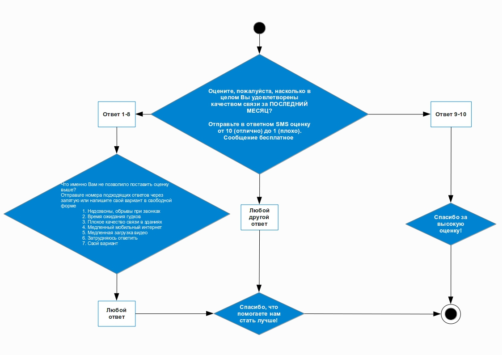

# Исследование опроса клиентов телеком-компании
 

Извенстная телеком-компания (из большой тройки) провела опрос своих клиентов, предложив им оценить уровень удовлетворённости качеством связи. По каждому клиенту, прошедшему опрос, были собраны технические показатели.  
Необходимо провести исследование и проанализировать, как зависит (и зависит ли) оценка, которую ставит клиент в опросе, от технических показателей, которые были собраны.    

В ходе опроса компания предложила своим клиентам оценить уровень удовлетворённости качеством связи по десятибалльной шкале (где 10 — это «отлично», а 1 — «ужасно»). Если клиент оценивал качество связи на 9 или 10 баллов, опрос заканчивался. Если клиент ставил оценку ниже 9, задавался второй вопрос — о причинах неудовлетворённости качеством связи с предоставленными пронумерованными вариантами ответа. Ответ можно было дать в свободном формате или перечислить номера ответов через запятую. Ниже представлена блок-схема опроса: 

## Codebook

`data.csv` содержит следующие значения:   
&nbsp;&nbsp;&nbsp;&nbsp; `user_id` — идентификатор абонента; 
&nbsp;&nbsp;&nbsp;&nbsp; `Q1` — ответ на первый вопрос; 
&nbsp;&nbsp;&nbsp;&nbsp; `Q2` — ответ на второй вопрос; 
&nbsp;&nbsp;&nbsp;&nbsp; `Total Traffic(MB)` — объем трафика передачи данных 1 ;  
&nbsp;&nbsp;&nbsp;&nbsp; `Downlink Throughput(Kbps)` — средняя скорость «к абоненту» 2 ; 
&nbsp;&nbsp;&nbsp;&nbsp; `Uplink Throughput(Kbps)`— средняя скорость «от абонента» 3 ; 
&nbsp;&nbsp;&nbsp;&nbsp; `Downlink TCP Retransmission Rate(%)` — частота переотправок пакетов «к абоненту» 4 ; 
&nbsp;&nbsp;&nbsp;&nbsp; `Video Streaming Download Throughput(Kbps)` — скорость загрузки потокового видео 5 ; 
&nbsp;&nbsp;&nbsp;&nbsp; `Video Streaming xKB Start Delay(ms)` — задержка старта воспроизведения видео 6 ; 
&nbsp;&nbsp;&nbsp;&nbsp; `Web Page Download Throughput(Kbps)` — скорость загрузки web-страниц через браузер 7 ; 
&nbsp;&nbsp;&nbsp;&nbsp; `Web Average TCP RTT(ms)` — пинг при просмотре web-страниц8 . 

1  — Насколько активно абонент использует мобильный интернет. 
2  — Считается по всему трафику передачи данных. 
3  — Считается по всему трафику передачи данных. 
4  — Чем выше, тем хуже. Если в канале возникает ошибка, пакет переотправляется. Снижается полезная скорость. 
5  — Чем выше, тем лучше — меньше прерываний и лучше качество картинки. 
6  — Сколько времени пройдёт между нажатием на кнопку Play и началом воспроизведения видео. Чем меньше это время, тем быстрее начинается воспроизведение. 
7  — Чем выше, тем лучше. 
8  — Чем меньше, тем лучше — быстрее загружаются web-страницы. 

Первый технический показатель представлен как сумма за период в одну неделю перед участием в опросе. Остальные технические показатели отображают среднее значение по данному признаку за период в одну неделю перед участием в опросе.

## Задача исследования

Основная цель исследования состояла в том, чтобы определить зависят ли оценки клиентов в опросе от собранных технических показателей.
В исходных данных собрана информация, о показателях, связанных с передачей данных через интернет. Поэтому главная гипотеза исследования сформулирована так:
**жалобы клиентов на мобильный интернет подтверждаются собранными техническими показателями.**

Данная гипотеза является достаточно общей, поэтому исследование было разбито на 4 части, в которых проверялись локальные гипотезы, которые помогут подтвердить или опровергнуть главную гипотезу:

* Недовольных качеством связи клиентов большинство.
* Между показателями, характеризующими скорость мобильного интернета, есть корреляция.
* Между скоростью интернета и ответом клиентов есть корреляция.
* Между скоростью мобильного интернета и переотправкой пакетов есть корреляция.

### Структура проекта

      презентация/                            презентация с описанием результатов исследования
      doc/                                    вспомогательные документы (расчетные таблицы, картинки и т.п.)
      data/                                   пример исходных данных
      Telecom_survey_results_analysis.ipynb   ноутбук с отчетом исследования результатов опроса (обработка и анализ данных, статистические тесты, выводы и рекомендации)

